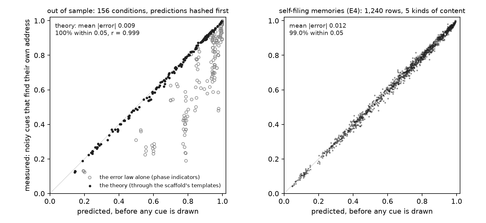
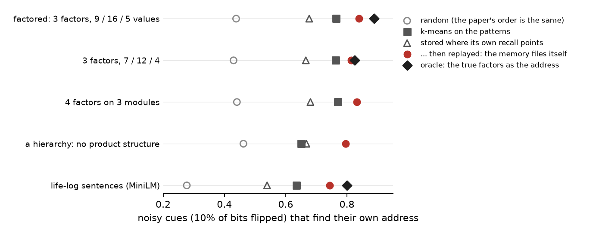
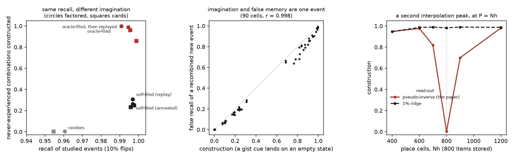
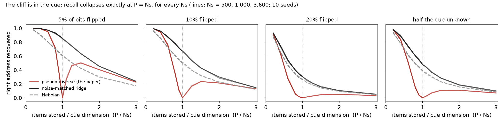
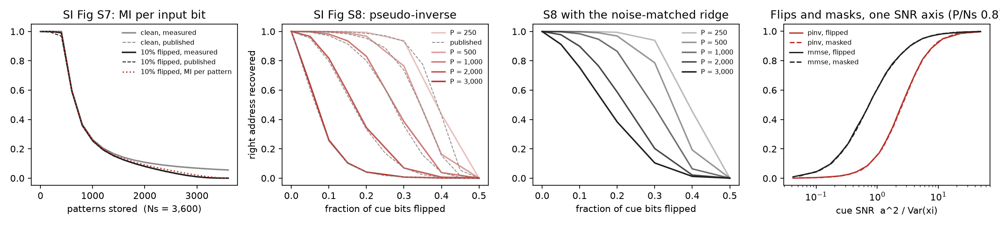
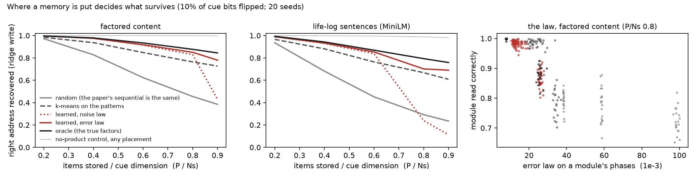

# loci

A memory that files itself, a theory that predicts it, and the one thing accuracy cannot teach it:
to imagine.

Vector-HaSH (Chandra, Sharma, Chaudhuri & Fiete, *Nature* 2025) stores memories the way the
hippocampus is thought to. A fixed **scaffold** of grid-cell modules combines into 3,600 addresses,
each an error-correcting fixed point, and content is bound to addresses by heteroassociation. A cue
recalls by snapping to an address and reading out what is stored there. The paper leaves one choice
open: *where* each memory goes. For content without a spatial layout, "the scaffold trajectory can
be arbitrarily chosen".

loci shows that the choice decides what the memory can do, and answers three questions about it.
Each answer was pre-registered and tested on seeds no pilot had touched. Every criterion is in
[`docs/PREREG.md`](docs/PREREG.md), and the git history shows each one committed before the run it
governs.

1. **Can the effect of a choice be predicted?** Yes. The theory has no fitted parameters and never
   simulates a cue. It predicts how often a noisy cue finds its own memory to within **0.009** on
   average, over 156 conditions it was never developed on: new content, new scaffolds, new noise,
   new sizes. Every prediction was hashed before measurement.
2. **Can the memory make the choice itself?** Mostly. The theory says the best place for a new
   memory is where its own recall points. It also says that replaying a memory, with its own trace
   set aside, computes exactly where the memory should move. A memory that does just that, with no
   labels and no knowledge of the content, beats k-means on five kinds of content. It comes within
   0.01–0.06 of an oracle that knows the content's true structure.
3. **Does filing for accuracy teach a memory to imagine?** No.
   - Filed by itself, the memory recalls as well as the oracle-filed one when every address counts
     as a valid state (0.997 against 0.991). Asked for a combination it has never experienced, it
     constructs it **31%** of the time; the oracle-filed memory does so **100%** of the time.
   - Where the structure is present, imagination is free for recall. Its price is truth. A new
     event that recombines familiar parts is recalled as experienced exactly as often as the
     combination is constructed (r = 0.998 over 90 conditions).
   - Familiarity cannot tell such an event apart. Only recollection, checking what was recalled
     against the cue, rejects it.

```python
import numpy as np
from loci import consolidate, theory
from loci.content import factored
from loci.memory import Memory, flip, mmse_alpha
from loci.scaffold import Scaffold

scaffold = Scaffold()                                     # the paper's scaffold: modules of period 3, 4, 5
events = factored(1_000, 800, np.random.default_rng(0))   # 800 events of 1,000 bits, 3 hidden factors
alpha = mmse_alpha(800, flip_rate=0.1)                    # the write matched to cues with 10% of bits flipped

where, K = consolidate.encode(events.patterns, scaffold, alpha)           # each where its own recall points
where = consolidate.replay(K, scaffold, where, np.random.default_rng(1))  # replay: exact descent on recall error

print(theory.predict(scaffold, events.patterns, where, alpha, flip_rate=0.1).address)  # 0.869, before any cue
memory = Memory(scaffold, rule="ridge", alpha=alpha)
memory.store(events.patterns, where)
cues = flip(events.patterns, 0.1, np.random.default_rng(2))
print((memory.recall(cues).address == where).mean())                      # 0.864, measured
```

This is a study of how scaffold memories work and fail, not a better memory. kNN over the stored
patterns keeps 800,000 bits, against the scaffold's 840,000 weights, and recalls everything.

## 1. A theory that predicts the memory



Recall is a chain, and every link has known statistics:
- A cue s̃ = a·s + ξ becomes coefficients c̃ = K Sᵀ s̃ over the stored items, where
  K = (SᵀS + αI)⁻¹. Their first two moments are exact: mean a(eᵢ − αKeᵢ), covariance σ²(K − αK²).
- The place-cell input u = H c̃ is Gaussian, by the central limit theorem over the cue's bits.
- The ReLU h₀ = ReLU(u) is moment-matched.
- The grid input x = W_gh h₀ is then Gaussian over all grid cells.
- Recall is the probability that every module's argmax lands on the right phase.

Nothing is fitted and no cue is drawn: the prediction needs only the stored patterns, the scaffold
and the placement ([`src/loci/theory.py`](src/loci/theory.py)). The argmax probability is taken by
Monte Carlo over that Gaussian, so the theory is semi-analytic, not closed-form. The derivations are
in [`docs/THEORY.md`](docs/THEORY.md).

It was developed on 180 factored-content conditions, where its mean error was 0.010, the sampling
floor of one cue per item. Then it was frozen and hashed, and it predicted 156 conditions that each
change something it had not seen. The frozen code, the hashes, the UTC timeline and the one logged
patch are in [`results/oos/`](results/oos). [`bench/oos.py`](bench/oos.py) re-verifies the hashes and
the scores.

| new in these conditions | mean \|error\| |
|---|---|
| sentence embeddings (MiniLM, sign-projected) | 0.007 |
| factor counts that match no module (7 / 12 / 4) | 0.008 |
| other scaffolds: periods (5, 6, 7), a fourth module (3, 4, 5, 7) | 0.009, 0.007 |
| half and double the place cells (Nh 200, 800) | 0.004, 0.008 |
| other cue dimensions (Ns 500, 2,000) | 0.007, 0.010 |
| masked cues instead of flipped (25%, 50% unknown) | 0.006, 0.004 |
| new loads (P/Ns 0.3, 0.5, 0.7) | 0.007 |
| the paper's own write rule (pseudo-inverse) | **0.029**, optimistic |
| **all 156** | **0.009**; every one within 0.05; r = 0.999 |

- **The pseudo-inverse read is where it is weakest.** The theory is optimistic there by 0.029, and 9
  of its 10 worst rows are pseudo-inverse rows.
- **E4's self-filing memories were a second test.** No placement of that kind was in the development
  set. Over 1,240 of those rows the mean error was 0.012 and 98.9% were within 0.05, but the worst
  row was off by 0.068. That exceeds the pre-registered 0.06, so that criterion **failed**.
- **The error law alone fails.** Project K through the phase indicators instead of the scaffold's
  templates W_gh H, and the mean error on the same conditions is 0.187. That law ranks placements,
  but it cannot give their size. The magnitudes live in the scaffold.

## 2. A memory that files itself

Two exact identities, both from the block inverse of K, turn the theory into a procedure:
- **Encoding.** A new item s has ridge coefficients c over the stored items and prediction error
  r = sᵀs + α − sᵀSc. Putting it on phase k of module m raises the error law Σ qᵀKq by
  ‖Q_mᵀc − e_k‖² / r. So the cheapest address is the free one where the item's own recall is
  largest: **store where your recall points.**
- **Replay.** A stored item's recall is c = eᵢ − αKeᵢ. The part that spreads onto other items,
  −αKeᵢ, is −α/2 times the gradient of the error law for moving it. So replay, recall with the
  item's own trace set aside, is exact coordinate descent: **move it to where that recall points.**

Every module keeps its full phase count (9, 16, 25), so nothing is matched to the content. Capacity
grows with the count so far, so the memory never knows how many items will come
([`src/loci/consolidate.py`](src/loci/consolidate.py)).



Noisy cues (10% flips) that find their own address, P/Ns = 0.8, seeds 40–49
([`bench/consolidate.py`](bench/consolidate.py)):

| content | random | k-means | stored where recall points | **… then replayed** | oracle |
|---|---|---|---|---|---|
| 3 factors, 9 / 16 / 5 values | 0.438 | 0.765 | 0.677 | **0.839** | 0.888 |
| 3 factors, 7 / 12 / 4 (no module matches) | 0.430 | 0.764 | 0.666 | **0.815** | 0.826 |
| 4 factors on 3 modules | 0.441 | 0.770 | 0.681 | **0.832** | – |
| a 5 × 4 hierarchy (no product structure) | 0.462 | 0.650 | 0.668 | **0.795** | – |
| life-log sentences | 0.277 | 0.636 | 0.539 | **0.743** | 0.800 |

- **Against k-means:** the self-filing memory beats it by 0.05–0.15 on every kind (S1, pass).
- **Encoding alone** beats random by 0.21–0.26 (S3, pass).
- **Against the oracle it falls 0.011, 0.049 and 0.057 short.** The pre-registered bar was 0.03, so
  that criterion **failed** (S2). The pilots had suggested parity; the fresh seeds say close, not
  equal.
- **Replay does most of the optimising.** Replay from random addresses lands within 0.04 of replay
  after recall-guided encoding. The encoding's value is that the memory is organised from the first
  item on (0.68 against 0.44 before any replay).
- **Replay also improves the oracle:** 0.898, 0.866 and 0.819 against 0.888, 0.826 and 0.800.
- **What is exact here.** The coefficients come from K, the ridge's own posterior precision,
  maintained by recursive least squares. The network's Hebbian snap delivers the same choice for
  most new items at an organised placement but only 50–66% at a random one, which is not enough to
  organise with. The rule is the network's recall; running it through the network's own snap is
  not yet solved.

## 3. Accuracy is silent about structure

For each value of one factor, one partner of another is never experienced with it. The memory is
then asked three things:
- a **gist** cue, the factors of a never-experienced combination alone: does it *construct* the
  combination, landing on an empty address whose read-out carries every factor?
- a **recombined** event, those factors with new detail: is it *falsely recalled* the same way?
- how well **familiarity** (the match of h₀ to the recalled state) and **recollection** (the match of
  the read-out to the cue) tell studied events from recombined ones.

Three decoders read the same place activity:
- the paper's **snap**;
- **nearest**, the nearest of all 3,600 place codes by cosine, where every address is a valid state;
- **stored**, the nearest stored code, where no empty state is valid.



Factored content, 10% flips, seeds 40–49 ([`bench/imagine.py`](bench/imagine.py),
[`src/loci/imagine.py`](src/loci/imagine.py)):

| filed by | decoder | recall | constructs | false recall | familiarity d′ | recollection d′ |
|---|---|---|---|---|---|---|
| random | snap | 0.430 | 0.001 | 0.002 | 1.9 | 1.5 |
| random | nearest | 0.961 | 0.004 | 0.002 | 3.5 | 5.4 |
| the true factors (oracle) | snap | 0.878 | 0.948 | 0.895 | 2.1 | 4.6 |
| the true factors (oracle) | **nearest** | **0.991** | **0.999** | **0.983** | **3.1** | **10.2** |
| the true factors (oracle) | stored | 0.991 | 0 | 0 | 7.5 | 10.9 |
| itself, replay | nearest | **0.997** | **0.307** | 0.267 | 4.0 | 7.9 |
| itself, annealed replay | nearest | 0.997 | 0.262 | 0.195 | 4.4 | 8.0 |
| the true factors, then replay | nearest | 0.995 | 0.990 | 0.965 | 3.2 | 10.5 |
| kNN on the stored patterns | | 1.000 | 0 | 0 | 25.1 | |

What held, every criterion passing on fresh seeds:
- **Construction needs structure** (I1). The oracle-filed memory constructs 0.999 of the
  never-experienced combinations on factored content, 0.960 with 7 / 12 / 4 factors and 0.910 on
  sentences. Random placement constructs none (≤ 0.004).
- **Imagination is free for recall** (I2). Letting every tuple be a valid state costs the
  oracle-filed memory 0.000–0.003 of recall. The larger cost of the paper's snap (0.878 against
  0.991) belongs to deciding each module on its own, not to imagination. Under random placement the
  snap costs 0.53–0.56 and constructs nothing.
- **Accuracy is silent about structure** (I3). The self-filed memory recalls as well as the
  oracle-filed one, but constructs 0.69–0.73 less. On 7 / 12 / 4 factors it constructs 0.233 against
  0.960, and on sentences 0.105 against 0.910, while recalling better (0.977 against 0.938).
  - Annealed replay aligned its modules with the factors on 0 of 30 runs.
  - This is a failure of search, not of the objective. The error law strongly prefers the aligned
    state (0.78 against 1.38 on factored content). But recall barely registers the difference:
    0.991 against 0.997 with every state valid, and 0.888 against 0.839 through the paper's snap.
    Replay from the memory's own encoding never gets there.
- **Consolidating for recall erodes imagination** (I4). Replaying an aligned memory for recall
  improves its recall and lowers its construction: by 0.10 on 7 / 12 / 4 factors (0.960 → 0.858)
  and 0.04 on sentences.
- **Imagination and false memory are one event** (I5). Over all 90 conditions, construction and
  false recall correlate at r = 0.998. A recombined event *is* a gist cue at a lower signal-to-noise,
  so a decoder that sees only place activity cannot construct one without being fooled by the other.
- **Recollection rejects what familiarity accepts** (I6). Familiarity separates recombined events
  from studied ones only weakly (d′ 3.1), less than half as well as when empty states are not valid
  (7.5). Recollection separates them well (d′ 10.2), because it checks the cue's detail, which place
  activity cannot see. That is the dual-process signature of recognition (Yonelinas 2002).
- **A second interpolation peak** (I7). The read-out W_sh = S H⁺ interpolates exactly when the items
  stored equal the place cells. There, construction collapses (0.003 at P = Nh = 800) while stored
  recall stays perfect. A 1% ridge on the read-out restores it (0.98). It mirrors the cue-side peak
  at P = Ns from round 1, and it is invisible in the paper's capacity curves.

**What is new here, and what is not.** Constructive memory is an old idea (Schacter & Addis 2007;
Hassabis & Maguire 2007), and so are models of it:
- REMERGE's recurrent similarity (Kumaran & McClelland 2012);
- Spens & Burgess's replay-trained generative network (2024), in which imagination and distortion
  both come from a separate cortical model;
- attractor mixtures (Amit, Gutfreund & Sompolinsky 1985);
- attractors for unseen feature combinations (Kalaj et al. 2025).

The claim here is narrower. In a grid-scaffold memory, a never-experienced combination is one of the
memory's own designed, equally deep fixed points, a valid word of a distance-1 product code. So
whatever decoding constructs it from a gist cue also recalls a recombined event as experienced.
Placement and the set of states the decoder admits fix both rates together.

Two cautions:
- **The nearest decoder is not native.** It needs one unit per address, which the paper's scaffold
  does not have.
- **The human evidence is mixed.** Hippocampal damage raises conjunction false alarms but lowers
  DRM errors, and sleep's effect on false memory varies across studies. No claim is made about
  either.

## Pre-registered criteria, round 2

Seeds 40–49 (E4, E5) and 30–32 (E3), none touched by a pilot. Bars are paired bootstrap 95% intervals
over seeds. [`bench/criteria.py`](bench/criteria.py) and [`bench/oos.py`](bench/oos.py) recompute every
row, and the criteria code was committed before each set of results was read.

| | criterion | result |
|---|---|---|
| T1 | out of sample: mean error ≤ 0.02, ≥ 90% within 0.05 | pass: 0.009, 100% |
| T2 | no condition family's mean error > 0.04 | pass: worst 0.029 (pseudo-inverse) |
| T3 | on E4's rows: mean error ≤ 0.02 and worst ≤ 0.06 | **fail**: 0.012, worst 0.068 |
| S1 | self-filing ≥ k-means + 0.05 on every content | pass: +0.051 to +0.145 |
| S2 | self-filing within 0.03 of the oracle | **fail**: −0.011 [−0.036, 0.015], −0.049, −0.057 |
| S3 | encoding alone ≥ random + 0.15 | pass: +0.21 to +0.26 |
| I1 | construction: oracle ≥ 0.9 / 0.9 / 0.8, random ≤ 0.05 | pass: 0.999 / 0.960 / 0.910; ≤ 0.004 |
| I2 | every state valid costs the aligned memory ≤ 0.01 of recall | pass: 0.000 to 0.003 |
| I3 | self-filed: recall within 0.02, construction ≥ 0.4 lower | pass: +0.006 / +0.000; −0.69 / −0.73 |
| I4 | replaying an aligned memory for recall lowers its construction | pass: −0.10 [−0.14, −0.07] |
| I5 | r(construction, false recall) ≥ 0.9; oracle false recall ≥ 0.8 | pass: 0.998; 0.98 / 0.90 / 0.86 |
| I6 | recollection d′ ≥ 5 while familiarity d′ ≤ 4 | pass: 10.2 / 10.3 and 3.1 / 3.8 |
| I7 | construction ≤ 0.05 at P = Nh; ≥ 0.9 with a 1% read-out ridge | pass: 0.003; 0.982 |

Round 2 passed 11 of its 13 criteria; round 1 failed 8 of its 17. Every failure is reported where
its number is.

## Round 1: the cliff in the cue, and why placement matters

Round 1 established the setting round 2 builds on:
- with the paper's write rule, noisy recall collapses when the items stored reach the cue dimension;
- the grid loses noisy cues in its module-by-module snap;
- content-aware placement recovers much of what is lost.

### The cliff is in the cue

Right address recovered at P = Ns. Mean over Ns = 500, 1,000 and 3,600; 10 seeds; the paper's
placement ([`bench/cliff.py`](bench/cliff.py)).

| cue | pseudo-inverse (the paper) | **noise-matched ridge** | Hebbian | kNN, P × Ns bits |
|---|---|---|---|---|
| clean | 1.000 | 1.000 | 0.699 | 1.000 |
| 5% of bits flipped | **0.001** | **0.851** | 0.604 | 1.000 |
| 10% flipped | 0.001 | 0.668 | 0.501 | 1.000 |
| 20% flipped | 0.001 | 0.303 | 0.264 | 1.000 |
| 25% of bits unknown | 0.001 | 0.793 | 0.575 | 1.000 |
| 50% unknown | 0.000 | 0.479 | 0.386 | 1.000 |



The pseudo-inverse's minimum sits at exactly P/Ns = 1.0 for every Ns and every kind of noise. Its
noise gain grows as P / (Ns − P − 1). Past that point the scaffold snaps to a *valid but wrong*
address, and nothing downstream compares the recall with the cue. The ridge strength that fixes it
is α = Var(ξ)·P / a² for a cue a·s + ξ; for flips, 4f(1 − f)P / (1 − 2f)². None of this is new as
mathematics: projection-rule memories lose their basins as P → N (Personnaz, Guyon & Dreyfus 1986;
Kanter & Sompolinsky 1987), the peak at P = N and its removal by weight decay are Krogh & Hertz
1992, and it is double descent (Belkin et al. 2019; Hastie et al. 2022; Nakkiran et al. 2021). What
is new is where it sits. The preprint says that from "a highly corrupted memory pattern" the
scaffold dynamics "recover the exact scaffold state … even deep in the memory continuum" (bioRxiv
v2, p. 9). The review response says noisy cues give "the correct grid and hippocampal states". The
SI shows the qualification: exact recovery from 10%-flipped cues falls with load (Fig S8, whose
caption attributes it to "overcrowding … within the sensory-to-hippocampal weights"), to 0.28 at
3,000 items. What it does not show is where the fall ends: at P = Ns. The paper's choice of
Ns = Npos = 3,600, the smallest its clean-cue analysis allows (SI D.1), puts that point at the
right-hand edge of every capacity plot. This is a double-descent dip in the cue map, not the
clean-cue memory cliff the paper's title claim is about.

Against the paper's own figures, with the published curves parsed from the SI's vector graphics
([`bench/paper_figs.py`](bench/paper_figs.py), 10 seeds):

| check | result |
|---|---|
| SI Fig S7, MI per input bit, 10% flips | reproduced; max deviation 0.023 |
| SI Fig S8, recovery vs flip rate | max deviation 0.0305 against a 0.03 bar: **fails by 0.0005**; 5 of 10 seeds pass alone |
| flips and masks on one axis, SNR = a² / Var(ξ) | collapse to within 0.016 |
| one ridge strength blind to the noise, α = cP | **fails**: c = 0.3 stays within 0.015 up to 10% flips, falls 0.074 short at 20% |



### Where a memory is put

The content has known structure. Each item is sign(A + B + C + z): three factors (think person,
project, activity) with 9, 16 and 5 values, plus the item's own detail. The second kind of content
is a life-log of templated sentences ("Maya fixed a failing test in the Heron project on the
train…"), embedded with all-MiniLM-L6-v2 and sign-projected to 1,000 bits
([`bench/lifelog.py`](bench/lifelog.py)). Ns = 1,000; 20 seeds; identical patterns and cues across
every row ([`bench/placement.py`](bench/placement.py)).

Right address recovered at P/Ns = 0.8, 10% flips:

| placement | pseudo-inverse | ridge | ridge + best stored address | no-product control |
|---|---|---|---|---|
| **factored content** | | | | |
| sequential (the paper's) | 0.138 | 0.455 | 0.849 | 0.999 |
| random | 0.137 | 0.455 | 0.833 | 0.999 |
| k-means, per module | 0.387 | 0.764 | 0.853 | 0.998 |
| learned, noise law | 0.492 | 0.830 | 0.900 | 0.998 |
| **learned, error law** | **0.553** | **0.850** | **0.908** | 0.998 |
| oracle | 0.610 | 0.877 | 0.915 | 0.999 |
| **life-log sentences** | | | | |
| sequential (the paper's) | 0.052 | 0.284 | 0.701 | 0.988 |
| random | 0.055 | 0.293 | 0.681 | 0.989 |
| k-means, per module | 0.197 | 0.668 | 0.755 | 0.989 |
| learned, noise law | 0.021 | **0.240** | 0.519 | 0.987 |
| **learned, error law** | **0.274** | **0.702** | **0.776** | 0.988 |
| oracle | 0.372 | 0.794 | 0.840 | 0.988 |
| kNN on the stored patterns | | | 1.000 / 0.999 | |



Near the cue limit, placement matters, and only there. At P/Ns = 0.2 the placements are within
0.003 of each other on the best-stored-address read (0.008 on sentences). With 20% of bits flipped
the gap widens. On factored content at P/Ns = 0.8, random recovers 0.120, the error-law placement
0.638 and the oracle 0.715. The noise-law placement collapses to 0.048: at high noise the bias it
ignores is most of the error.

**Why the error law.** The cue map writes a cue as coefficients c = (SᵀS + αI)⁻¹Sᵀs̃ over the stored
items, and a module phase receives the sum of the coefficients of the items placed on it. At the
noise-matched α, the squared error of those coefficients (bias plus variance) is
σ²(SᵀS + αI)⁻¹, the posterior covariance of Bayesian linear regression (Bishop 2006, §3.3).
[`tests/test_place.py`](tests/test_place.py) checks the identity by sampling flipped cues. At α = 0
it is the noise law. The optimal placement groups items whose coefficients are anti-correlated,
which means items that are partially correlated. The learned placement finds such groups by
pairwise swaps from 20 random balanced starts, per module, with no labels and no coupling between
modules. With k groups, the partition that cancels the most error is the one along a factor with
about k values. So which module takes which factor falls out of the law. On the sentences, the
error-law placement recovers the three factors at NMI 0.70 / 0.92 / 0.84; the noise-law placement
at 0.09 / 0.17 / 0.41.

**What survives a wrong recall.** When the address is wrong, the read-out is a blend of the items
that share its phases. With aligned placement those items share the item's factors. Factors read
off wrong recalls, factored content, seeds 0–9:

| placement | person (1 in 9) | project (1 in 16) | activity (1 in 5) |
|---|---|---|---|
| random | 0.18 | 0.14 | 0.26 |
| learned, noise law | 0.95 | 0.94 | 0.77 |
| oracle | 1.00 | 1.00 | 0.74 |

Gist survives. A missing facet does not. Give a cue with the project left out, and ask the memory
for it: Vector-HaSH answers 0.16–0.26 on factored content and 0.08–0.19 on sentences, against
kNN's 1.00 and 0.88. Aligned placement is *worse* at this (oracle 0.16, random 0.22). When the
address encodes the project, a cue without the project cannot find the address.

### Where the grid loses noisy cues

The no-product control is the same model with one module of 3,600 phases. That gives random sparse
place codes, the same 400 place cells, and a snap to the nearest of all 3,600 codes. It is
exchangeable by construction, so placement cannot matter there, and it doesn't (oracle − random
= 0.000). Through the scaffold's snap it beats the grid outright.

Two reads of the same cue-map output separate the codebook from the decoder. The grid's snap
decides each module on its own. The second read, which the grid does not have natively, takes the
nearest of all 3,600 place codes by cosine. Exploratory, not pre-registered
([`bench/budget.py`](bench/budget.py), random placement, P/Ns = 0.8, 10 seeds):

| code | weights | clean | snap, 10% / 20% flipped | nearest code (cosine), 10% / 20% |
|---|---|---|---|---|
| grid, 400 place cells (the paper's) | 840,000 | 1.000 | 0.467 / 0.129 | 0.963 / 0.591 |
| no product, 91 place cells | 837,200 | 0.908 | 0.498 / 0.245 | 0.970 / 0.743 |
| grid, 1,750 place cells | 3,675,000 | 1.000 | 0.731 / 0.262 | 0.983 / 0.725 |
| no product, 400 place cells | 3,680,000 | 1.000 | 0.998 / 0.940 | 1.000 / 1.000 |

At 10% flips the grid's codebook is nearly as good as random codes (0.963 against 0.970 at equal
weights). Almost everything the grid loses is lost in the module-by-module snap. At 20% flips the
correlated codebook costs as well: codes that share residues are confusable, and the items behind
them pool their noise. Placement is how the grid gets part of it back.

### Round 1's criteria

Criteria were written in [`docs/PREREG.md`](docs/PREREG.md) before the confirmatory runs. The
amendments are logged there, with their reasons, before the runs they apply to. E2's registered
criteria are judged on seeds 0–9, and amendment 4's error law on seeds 10–19.

| | criterion | factored | life-log |
|---|---|---|---|
| E1.1 | the paper's S7 / S8 within 0.03 | S7 pass · S8 **fail** (0.0305) | |
| E1.2 | flips and masks collapse on SNR (≤ 0.05) | pass (0.016) | |
| E1.3 | one noise-blind ridge suffices | **fail** | |
| E1.4 | dense cues: recall halves at a P set by d, flat in Ns | **fail**: set by Ns | |
| P1 | module accuracy monotone in the law, ρ ≤ −0.8, pinv and ridge | **fail**: ridge's last module −0.64 | **fail**: ridge −0.48 to −0.66 |
| P2 | oracle ≥ random + 0.10 at P/Ns 0.8; equal at 0.2 | **fail**: +0.087 [0.071, 0.102] | pass: +0.156 [0.132, 0.181] |
| P3 | learned (noise law) ≥ k-means + 0.05 | pass: +0.055 [0.031, 0.076] | **fail**: −0.238 |
| P4 | aligned gain larger on the grid than the control by 0.05 | pass: +0.087 | pass: +0.158 |
| X1 | the error law predicts module accuracy, ρ ≤ −0.8 | **fail**: last module −0.72 | pass: −0.89 / −0.90 / −0.80 |
| X2 | error law ≥ noise law (by 0.05 on sentences), and > k-means | pass: +0.011; +0.049 [0.035, 0.065] | pass: +0.292; +0.059 [0.010, 0.099] |

P2–P4 are scored on the registered read, ridge + best stored address. It is the read on which
placement matters least: on the paper's pseudo-inverse the oracle's gain over random is five times
larger (+0.47). The last module is where each law is weakest, because its phase is a free slot
chosen by open addressing, not by content. **P4 could not have failed through its control**: the
control sits at ceiling, so P4 reduces to P2 with a lower bar. It says nothing about whether any
structured code would do as well as the grid.

## Corrections

Found by an internal red team after the first version was published (2026-09-30), and fixed here.

- **A decoder bias inflated the codebook's cost.** The first version decoded the grid's cue-map
  output to the nearest place code by raw dot product, found 0.695 against the control's 0.999,
  and concluded that "the loss is in the correlated codebook". A noisy cue's place activity is
  dominated by the component every code shares, so a dot product favours high-norm codes: wrong
  picks sat at the 85th–98th percentile of code norm. By cosine the same read recovers 0.963–0.976.
  The loss is in the snap. The registered "ridge + best stored address" read in the E2 tables
  also uses a dot product; by cosine it recovers about 0.99 for every placement at 10% flips,
  which is why placement matters much less on that read.
- **The paper quote.** "Even deep in the memory continuum" is from the bioRxiv preprint, not the
  review response. It concerns recovery of the *scaffold state* from a corrupted sensory cue, which
  is what this repository measures. The first version also said the paper's choice of Ns "put the
  peak just out of frame", which implied concealment. Ns ≥ P is the paper's stated condition, Ns =
  3,600 is the smallest it allows, and its S8 caption names the mechanism.
- **"One matrix predicts it."** The error law's rank correlation with accuracy is almost entirely
  between placement types. Within a placement it predicts little, and P1 and X1 failed on some
  content. It ranks placements. That is all the text now claims.
- **The learned placement's warm start.** The error-law search also started from the noise-law
  placement. The first version did not say so. From random starts alone, it falls below k-means on
  sentences (0.547 against 0.677).
- **The objective is known.** The error law is discriminative k-means (Ye, Zhao & Wu 2007), up to
  group-size scaling. The swap search is Kernighan–Lin-style partitioning.

## What did not survive

- **"The price of imagination is recall."** The thesis as first written said that treating
  never-stored states as valid costs noisy recall. It costs nothing under aligned placement (I2).
  The apparent cost belonged to the paper's per-module snap. The price is false memory.
- **"Consolidation discovers structure."** No recall-driven procedure tried aligned the modules with
  the factors at full phase resolution: greedy or annealed replay, independence penalties, restarts,
  the network's own read-out. It happens when the last module is read as a few coarse groups (5 of
  5 phases each) instead of 25 phases, i.e. when a granularity is supplied from outside.
- **"Prediction error gates integration."** It is exact but weak: the novelty term r scales the
  benefit of placement without changing its choice. The paper already routes novel inputs to fresh
  scaffold states.

- **"Dense cues break at the embedding dimension."** A pilot claimed that the item count at which
  dense-cue recall halves tracks the embedding dimension d, not Ns. With the library's scaffold it
  goes the other way: P50 grows 2.8–3.5× from Ns = 2,048 to 8,192 at every d
  ([`bench/dense.py`](bench/dense.py)). On LoCoMo, ranking turns by the ridge's own coefficients,
  before the place layer, gets R@1 0.227, above kNN's 0.188. So the loss is in the 400 place cells
  that conversations of 369–689 turns are squeezed through.
- **The registered learned placement.** A soft Sinkhorn assignment with each module fitted to the
  previous module's residual re-found module 1's partition in module 2. The swap search replaced it
  before the confirmatory run (amendment 1).
- **The noise law as a thing to minimise.** It survives as a description of the pseudo-inverse. As
  an objective under the ridge it is misleading (amendment 4).
- From the critic's pilot, before any of this: balanced occupancy does not buy robustness by
  itself, and a wrong recall is a related stored memory only at chance (24% against 22%).

Smaller things, measured and left in because changing them would change registered runs: the
life-log has a few exact duplicate entries (≈ 1/P on every arm alike); at 400 place cells, 6 of 20
scaffold seeds have one address out of 3,600 that is not a fixed point; and the random streams of
content and cues across different seeds overlap (never within a paired comparison).

## The upstream code

The port reproduces `FieteLab/VectorHaSH` at `c71317d` exactly. Its sensory error is identical to
every printed digit (0.2076 / 0.3091 / 0.3478 at 1,001 / 2,001 / 3,001 patterns). The clean-cue
overlap follows m = erf(√(Nh / (2(P − Nh)))) to within 0.002 (0.681 / 0.434 / 0.304 measured
against 0.683 / 0.436 / 0.305).

[`docs/AUDIT.md`](docs/AUDIT.md) lists twelve things a reader of the paper would not expect from the
code, each with file:line and its measured effect. A few examples:

- grid-to-place connectivity is 0.67, not the 0.60 its comment says;
- one baseline alone gets an MI floor in the comparison plot;
- the sequence plot's Vector-HaSH curve is loaded from the item-memory file (the notebook states
  this shortcut);
- the sequence demo resets to the true state at every step. Free-running recall with its settings
  fails at step 8, but runs all 1,001 steps without the clean-up step, or at 800 place cells.

The authors released working code under MIT, and none of this study would exist without it. The
placement question is one the paper itself leaves open ("the scaffold trajectory can be arbitrarily
chosen"), and the paper already proposes routing novel inputs to fresh scaffold states.

## Reproduce

```bash
uv sync --extra bench
uv run pytest                                              # 18 tests, seconds
uv run python bench/oos.py                                 # E3: verify the frozen test's hashes, score it
uv run python bench/consolidate.py                         # E4, seeds 40-49 (~20 min on 4 cores)
uv run python bench/imagine.py && uv run python bench/imagine.py --nh   # E5 (~10 min)
uv run python bench/criteria.py                            # every round-2 criterion, from the result files
uv run python bench/cliff.py                               # round 1, E1
uv run python bench/paper_figs.py                          # the paper's S7 / S8, SNR, blind ridge (~5 min)
LOCOMO=path/to/locomo10.json uv run python bench/dense.py  # dense cues + LoCoMo (~6 min)
uv run python bench/placement.py --content factored        # round 1, E2 (~15 min on 8 cores)
uv run python bench/placement.py --content lifelog         # E2 on sentences (~20 min)
uv run python bench/placement.py --verdict                 # round 1's E2 criteria
uv run python bench/budget.py                              # equal-weight controls (seconds)
uv run python bench/figures.py
```

All randomness is seeded; the result files in [`results/`](results) are the ones quoted here.
Timings are on an Apple M5 shared with other jobs. `locomo10.json` is from snap-research/locomo;
MiniLM is read from the local Hugging Face cache.

```
src/loci/scaffold.py      the grid scaffold: addresses, place codes, the snap
src/loci/memory.py        binding content to addresses; the write rules; recall
src/loci/theory.py        predicting recall from the stored patterns, the scaffold and the placement
src/loci/consolidate.py   encoding where recall points, and replay
src/loci/imagine.py       construction, false recall, familiarity and recollection
src/loci/place.py         round 1's placements, the noise and error laws
src/loci/content.py       factored and hierarchical content, with held-out combinations
bench/                    one script per experiment, the criteria, and the figures
docs/                     DESIGN, PREREG (with amendments), THEORY (the derivations), AUDIT
```

## References

- Chandra, Sharma, Chaudhuri & Fiete (2025). Episodic and associative memory from spatial scaffolds
  in the hippocampus. *Nature* 638. doi:10.1038/s41586-024-08392-y. Code: FieteLab/VectorHaSH (MIT,
  see [`NOTICE`](NOTICE)).
- Spens & Burgess (2024). A generative model of memory construction and consolidation. *Nature
  Human Behaviour*. doi:10.1038/s41562-023-01799-z.
- Kumaran & McClelland (2012). Generalization through the recurrent interaction of episodic
  memories (REMERGE). *Psychological Review*. doi:10.1037/a0028681.
- Schacter & Addis (2007), the constructive episodic simulation hypothesis; Hassabis & Maguire
  (2007), scene construction; Yonelinas (2002), dual-process recognition.
- Amit, Gutfreund & Sompolinsky (1985). Spin-glass models of neural networks.
  doi:10.1103/PhysRevA.32.1007. Kalaj et al. (2025), *Physica A*. doi:10.1016/j.physa.2025.130946.
- Bach & Harchaoui (2007), DIFFRAC; Ye, Zhao & Wu (2007), discriminative k-means: the error law's
  objective. Besag (1986), ICM: replay as coordinate descent. Bishop (2006) §3.3: the posterior
  covariance.
- Round 1's references are in the text above: Personnaz, Guyon & Dreyfus 1986; Kanter & Sompolinsky
  1987; Krogh & Hertz 1992; Belkin et al. 2019; Hastie et al. 2022; Nakkiran et al. 2021.

This repository is MIT-licensed.
